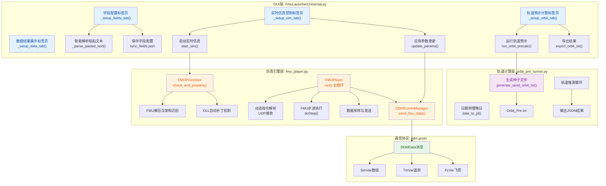
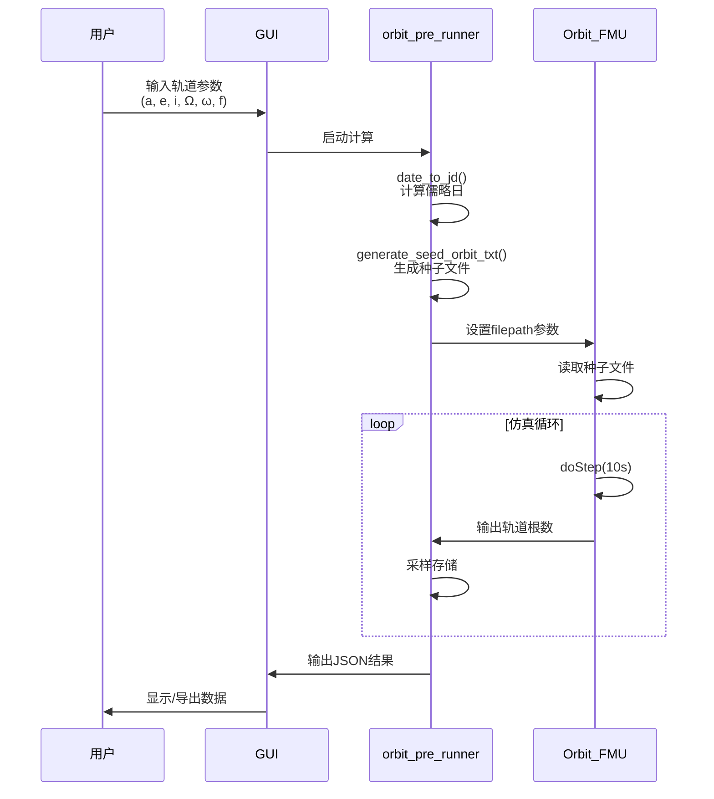

# FMUSolver

FMU (Functional Mock-up Unit) 求解器项目，用于卫星轨道仿真和能源系统建模。

## 项目结构

```
├── Script/           # 源代码脚本
│   ├── fmu_player.py      # FMU播放器核心逻辑
│   ├── fmu_controller.py  # FMU控制器
│   ├── patch_launcher.py  # 启动器补丁
│   └── ...
├── FmuSolver_Package/ # 打包后的可执行文件
│   ├── FmuSolver.exe      # 主求解器
│   ├── FmuWorker32.exe    # 32位工作进程
│   ├── FmuWorker64.exe    # 64位工作进程
│   └── ...
└── README.md          # 项目说明
```

## 功能特性

- FMU 模型加载和执行
- 卫星轨道仿真
- 能源系统建模
- UDP 数据通信

## 快速开始

运行打包后的可执行文件：

```bash
./FmuSolver_Package/FmuSolver.exe
```

## 开发

使用 Python 开发，主要依赖：
- Python 3.x
- protobuf
- base64

## 许可证

MIT License

## 1. 高层摘要（TL;DR）

*   **影响范围：** 🟢 **高** - 这是一个全新的卫星载荷仿真与轨道预示平台，包含完整的GUI应用、FMU仿真引擎、UDP通信协议和轨道计算模块。
*   **核心变更：**
    *   ✨ 新增完整的Tkinter GUI应用 `FmuLauncherUniversal.py`，支持实时仿真控制、轨道预示计算、字段配置和数据展示
    *   ✨ 实现FMU仿真引擎 `fmu_player.py`，支持动态参数热更新、UDP数据分发和跨架构DLL加载
    *   ✨ 新增32位轨道预示计算引擎 `orbit_pre_runner.py`，支持轨道根数推演和EOP数据处理
    *   ✨ 定义Protocol Buffer通信协议 `ddm.proto`，支持结构化仿真数据传输
    *   📦 配置PyInstaller打包规范，支持GUI和Worker进程独立打包

---

## 2. 可视化架构图



---

## 3. 详细变更分析

### 📦 组件一：GUI主应用（FmuLauncherUniversal.py）

**变更说明：**
新增532行完整的Tkinter GUI应用，实现卫星载荷仿真平台的用户交互界面。

**核心功能模块：**

| 模块 | 主要方法 | 功能描述 |
|------|----------|----------|
| 字段配置 | `_setup_fields_tab()` | 表格化管理FMU变量同步配置，支持手动添加和智能解析 |
| 智能解析 | `_parse_pasted_text()` | 使用正则表达式解析Modelica语法变量声明 |
| 实时仿真 | `_setup_sim_tab()` | 配置FMU路径、网络参数、初值和仿真策略 |
| 轨道预示 | `_setup_orbit_tab()` | 独立的轨道参数输入和离线计算控制 |
| 数据展示 | `_setup_data_tab()` | 显示轨道预示结果（前200行） |

**关键特性：**
- 🔄 **智能变量解析**：支持Modelica语法，自动识别数组变量 `Real MTSatPos[3]`
- 💾 **配置持久化**：字段配置保存至 `sync_fields.json`
- 🌐 **跨架构支持**：自动检测FMU架构（32/64位），调用对应Worker进程
- ⚡ **动态控制**：支持实时修改仿真步长、速率、采样频率

---

### ⚙️ 组件二：FMU仿真引擎（fmu_player.py）

**变更说明：**
新增480行FMU仿真核心引擎，实现FMU加载、执行和UDP数据分发。

**核心类与职责：**

| 类名 | 核心方法 | 职责 |
|------|----------|------|
| `FMUProcessor` | `check_and_prepare()` | FMU解压、架构识别、DLL自动补丁 |
| `DDMCommManager` | `send_fmu_data()` | UDP数据分包发送（支持200变量/包） |
| `FMUPlayer` | `run()` | 仿真主循环、动态指令处理 |

**关键技术实现：**

```python
# DLL架构检测
def check_dll_arch(filepath):
    """检测DLL的PE架构 (win32或win64)"""
    # 读取PE头判断0x014c (win32) 或 0x8664 (win64)

# 动态参数热更新
if "step_size" in cmd: 
    step_size = float(cmd["step_size"])
    # 实时更新仿真参数，无需重启

# 高精度时间同步
target_wall_time = sim_wall_anchor + (current_time - sim_time_anchor) / sim_rate
# 使用绝对时间锚点避免误差累积
```

**自动环境修复机制：**
- 扫描应用根目录的DLL文件
- 自动复制匹配架构的DLL到FMU工作目录
- 预加载所有DLL到进程空间（解决PyInstaller依赖问题）

---

### 🛰️ 组件三：轨道预示引擎（orbit_pre_runner.py）

**变更说明：**
新增293行32位轨道预示计算引擎，支持轨道根数推演。

**处理流程：**



**关键参数说明：**

| 参数 | 说明 | 约束 |
|------|------|------|
| `Year` | 计算年份 | 强制为2026（EOP数据范围限制） |
| `a_MT` | 半长轴 | 默认6766.71777 km |
| `e_MT` | 偏心率 | 默认0.00110 |
| `i_MT` | 轨道倾角 | 默认0.72653 rad |
| `step_size` | 计算步长 | 必须是10秒的倍数 |

---

### 📡 组件四：通信协议（ddm.proto）

**变更说明：**
新增Protocol Buffer定义，支持结构化仿真数据传输。

**消息结构：**

```protobuf
message DDMData {
  required double machine_time = 1;   // 机器时（1970基准）
  required double sim_time = 2;       // 仿真时间
  repeated SimVar sim_vars = 3;       // 仿真变量数组
  optional bool is_start_sim = 4;     // 仿真开始标识
  optional bool is_stop_sim = 5;      // 仿真停止标识
  repeated TmVar tm_vars = 6;         // 遥测数组
  repeated FcVar fc_vars = 7;         // 飞控指令数组
}
```

**变量类型映射：**

| Python类型 | Proto类型 | 字段名 |
|------------|-----------|--------|
| bool | Bool | bool_value |
| int | Int | int_value |
| float | Double | double_value |
| str | String | string_value |

---

### 📦 组件五：打包配置

**变更说明：**
新增PyInstaller打包规范，支持GUI和Worker进程独立打包。

| 配置文件 | 输出名称 | 入口文件 | 控制台 |
|----------|----------|----------|--------|
| `FmuSolver.spec` | FmuSolver.exe | FmuLauncherUniversal.py | 否 |
| `FmuWorker32.spec` | FmuWorker32.exe | worker_entry.py | 是 |

**打包特性：**
- 🎨 GUI应用使用卫星图标 `satellite_icon_149794.ico`
- 🔧 Worker进程保留控制台输出便于调试
- 📦 UPX压缩减小体积

---

### 🧰 组件六：辅助工具脚本

**新增工具列表：**

| 脚本名称 | 功能 |
|----------|------|
| `fmu_handler.py` | FMU文件解压、架构识别、XML解析 |
| `fmu_controller.py` | 命令行动态控制器（热更新参数） |
| `inspect_fmu.py` | FMU元数据检查工具 |
| `find_vars.py` | 变量名搜索工具 |
| `diag_*.py` | 一系列诊断脚本（6个） |
| `check_*.py` | DLL和变量检查工具 |

---

## 4. 影响与风险评估

### ⚠️ 破坏性变更
无（全新项目）

### 🔍 潜在风险点

| 风险项 | 影响 | 缓解措施 |
|--------|------|----------|
| **跨架构DLL加载** | 32/64位不匹配可能导致崩溃 | 自动检测架构并跳过不匹配的DLL |
| **UDP数据包溢出** | 变量过多可能超过64KB限制 | 实现分包机制（200变量/包） |
| **EOP数据年份限制** | 轨道计算强制使用2026年 | GUI添加警告提示，保留月日时分秒 |
| **时间同步精度** | Windows sleep精度约15ms | 使用spin-wait实现微秒级控制 |

### 🧪 测试建议

1. **GUI功能测试：**
   - 验证字段配置的保存和加载
   - 测试智能解析功能（粘贴Modelica代码）
   - 验证跨架构FMU的自动切换

2. **仿真引擎测试：**
   - 测试动态参数热更新（修改步长、速率）
   - 验证UDP数据分包和重组
   - 测试长时间运行的稳定性

3. **轨道计算测试：**
   - 验证不同轨道根数的计算结果
   - 测试种子文件生成和读取
   - 验证结果导出格式

4. **打包测试：**
   - 验证GUI和Worker独立运行
   - 测试依赖DLL的自动加载
   - 验证路径解析（开发环境vs打包环境）

---

## 5. 技术亮点总结

✨ **架构设计**：采用GUI-Worker分离架构，支持跨进程通信  
🔄 **动态控制**：实现仿真参数热更新，无需重启  
🛡️ **环境自适应**：自动检测架构、补丁DLL、解析路径  
📡 **高效通信**：Protocol Buffer + UDP分包，支持高频数据传输  
🎯 **轨道计算**：集成专业轨道推演引擎，支持EOP数据处理  
📦 **一键打包**：PyInstaller配置完善，支持独立部署